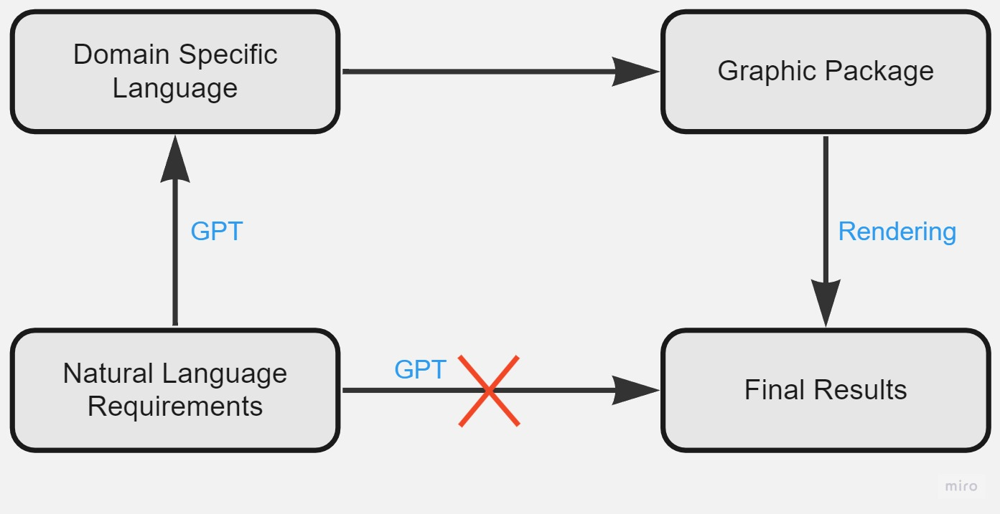
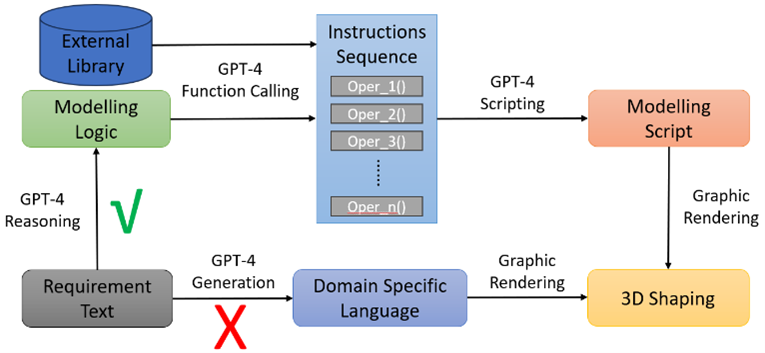
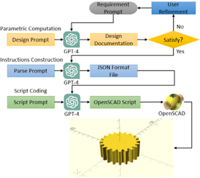

# AIDEA

#### *Artifical Intelligence, Intergrated Design Evironment, and IDEA*

Computer-Aided Design (CAD) with GPT, a future toward AI-Aided Design (AAD) 

 ## Introduction

This is a repo for an experimental project that uses GPT to generate CAD models. It is not a single end-to-end model generation, but try to varify whether GPT can be used to generate small system consists of several components based on human's design requriements. In addition, this system can be later checked and validated by human operators before entering to the manufacturing state. 

The main idea is that apply GPT to generate a domain specific language (DSL) to represent the CAD models, and then use some graphic software or packages to generate the CAD models based on the generated DSL. In short, it generates the logic of generation instead of generating the final result directly. Similar idea can be found in the work of [3D-GPT](https://arxiv.org/abs/2310.12945), which apply GPT to generate a large-scale of 3D landscape with [Blender](https://www.blender.org/). By this method, human and the AI can together maintenance a same system based on the common domain specific language (DSL), therefore, the final results can be more controllable and be further customized by human.

The core idea is **Generate the logic of generation, rather generate the result directly.**

## System Framework



The domain specific language and the graphic package in this project is [OpenSCAD](https://openscad.org/), which is a free CAD software that use object scripting (formal language programming) to generate 3D models. Thus, it is a good option for this project. Also, for convienience, an OpenSCAD library on Thingiverese [gear.scad](https://www.thingiverse.com/thing:636119) is also included in this project, which is placed in the folder `openscad`.



## Requirement

OpenSCAD: This is the 3D modelling package for rendering the scripts. The link for download and install can be found in the [official website](https://openscad.org/).

OpenAI API Key: The api key can be found on the [official website](https://platform.openai.com/account/api-keys). This is the key for accessing the GPT model remotely.

Platform:The whole project is run and tested on Windows 10. And it is expected that the project can be run on other platforms with some modifications since there is no requirement for the llm model deployment on the local host. 

## Usage

### 1. Install the environment
```
Conda create -n aidea python=3.11
conda activate aidea
pip install -r requirements.txt
```

### 2. Set the config file
```
{
    "OPENAI_API_KEY": "<YOUR OPENAI API KEY>",
    "GPT_MODEL": "gpt-4",
    "OPENSCAD_EXEC_PATH": "THE PATH OF OPENSCAD EXECUTABLE FILE e.g., .exe on Windows",
}
```
### 3. Run the Jupyter notebook

Run the Jupyter notebook in the `notebooks` directory to start the project.

## Some Examples
System of two spur gears


System of two helical gears


System of two herringbone gears


In above examples, the text in the red box is the requirement description as input, while textual instructions in the blue box contain obtained parameters computed by GPT-4. The images on the right is the generated CAD model after rendering by the OpenSCAD.

## TODO List
- [ ] Clean up and reconstruct the code from Jupyter notebook to a more structured and modular format.
- [ ] Apply more Pythonic rendering package such as the [CADQuery](https://github.com/CadQuery/cadquery).
- [ ] Apply a prompt tuning and soft prompt techniques to mitigate the requirement of the hand-carft prompt engineering and management.
- [ ] Apply more advanced agentic methods for the code generation to improve the capability for code composistion and abstraction, such as the RAG or AlphaCodium.
- [ ] Apply the current framework to a more complex system, such as this [gear system](https://hackaday.io/project/164732/gallery#f676692b124741662b011f2287a047bb).
- [ ] Explore on the spatio information representation to enable the LLM can understand the spatial relationship among different components in the assembly system.
- [ ] Explore on how to combine the current method with generative design methods.